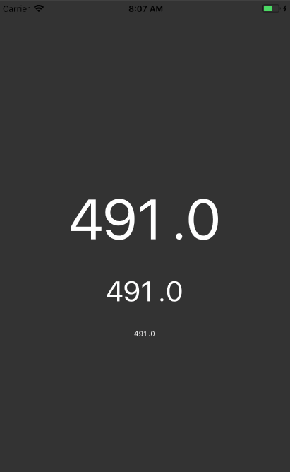

# React Native Ticker

Create rotating animations.

Can work with any number as well as other symbols like `$,.-`, etc.

```
yarn add react-native-ticker
npm install react-native-ticker
```

```js
import Ticker from "react-native-ticker";

// As a text prop
<Ticker text={"1235.44"} textStyle={styles.text} rotateTime={250} />;

// Or as a child
<Ticker textStyle={styles.text} rotateTime={250}>
  12345.44
</Ticker>

```

Supply a `textStyle`, as well as `text`. `rotateTime` is optional and defaults to `250ms`.


If you need more than just numbers you can build and supply your own rotations.

```js
import Ticker, { Tick } from "react-native-ticker";
const styles = StyleSheet.create({
  container: {
    flex: 1,
    alignItems: "center",
    justifyContent: "center",
    backgroundColor: "#333",
  },
  text: {
    fontSize: 40,
    color: "#FFF",
  },
});

function getRandom(min, max) {
  min = Math.ceil(min);
  max = Math.floor(max);
  return Math.floor(Math.random() * (max - min + 1)) + min;
}

const numbers = ["0", "1", "2", "3", "4", "5", "6", "7", "8", "9"];
const currencies = ["$", "¥", "€"];

export default class App extends Component {
  state = {
    currency: "$",
    value: "123",
  };

  componentDidMount() {
    setInterval(() => {
      this.setState({
        currency: currencies[getRandom(0, 2)],
        value: getRandom(0, 1000) + "",
      });
    }, 500);
  }

  render() {
    return (
      <View style={styles.container}>
        <Ticker textStyle={styles.text}>
          <Tick rotateItems={currencies}>{this.state.currency}</Tick>
          {this.state.value.split("").map((char, i) => {
            return (
              <Tick key={i} rotateItems={numbers}>
                {char}
              </Tick>
            );
          })}
          !!!
        </Ticker>
      </View>
    );
  }
}
```

You must render a `Ticker` and subsequently at least one `Tick`. If it is text then it will simply be rendered.


