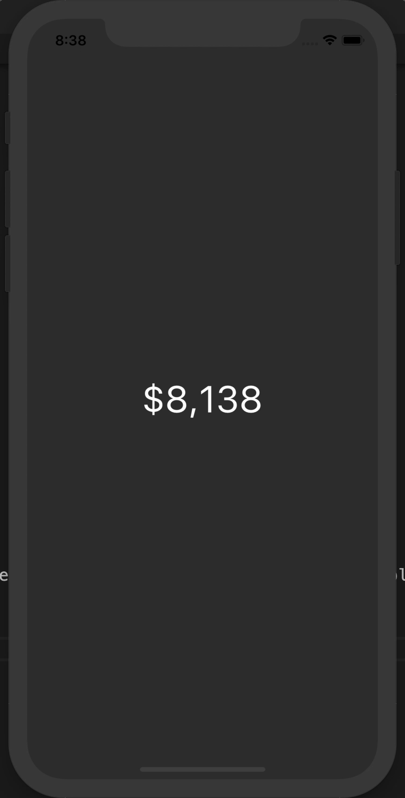

# React Native Ticker

Create rotating animations of any number, or character.

# Changes from v2 to v3

- Rebuilt with `react-native-reanimated`.
- Rebuilt with TypeScript.
- The `rotateTime` is now called `duration`.
- Now it measures all widths and heights of items and adjusts accordingly!
- Supply a `children` element with the value, we no longer support `text` prop.

# Install

```
yarn add react-native-ticker
npm install react-native-ticker
```

As of V3 we only support the children prop now.

```js
import Ticker from "react-native-ticker";

<Ticker textStyle={styles.text} duration={250}>
  12345.44
</Ticker>;
```

Supply a `textStyle`, and `duration` is optional and defaults to `250ms`.

If you need more than just numbers you can build and supply your own rotations.

```js
import React, { useState, useEffect } from "react";
import { View, StyleSheet } from "react-native";

import Ticker, { Tick } from "./ticker2";

function getRandom(min, max) {
  min = Math.ceil(min);
  max = Math.floor(max);
  return Math.floor(Math.random() * (max - min + 1)) + min;
}

const currencies = ["$", "¥", "€"];

const App = () => {
  const [state, setState] = useState({
      currency: currencies[getRandom(0, 2)],
      value: getRandom(0, 100000)
    });

  useEffect(() => {
    setInterval(() => {
      setState({
        currency: currencies[getRandom(0, 2)],
        value: getRandom(0, 100000)
      });
    }, 500);
  }, []);

  return (
    <View style={styles.container}>
      <Ticker textStyle={styles.text}>
        <Tick rotateItems={currencies}>{state.currency}</Tick>
        {state.value.toLocaleString()}
      </Ticker>
    </View>
  );
};

const styles = StyleSheet.create({
  container: {
    flex: 1,
    alignItems: "center",
    justifyContent: "center",
    backgroundColor: "#333"
  },
  text: {
    fontSize: 40,
    color: "#FFF"
  }
});

export default App;
```

You must render a `Ticker` and subsequently at least one `Tick`. If it is text then it will simply be rendered.


